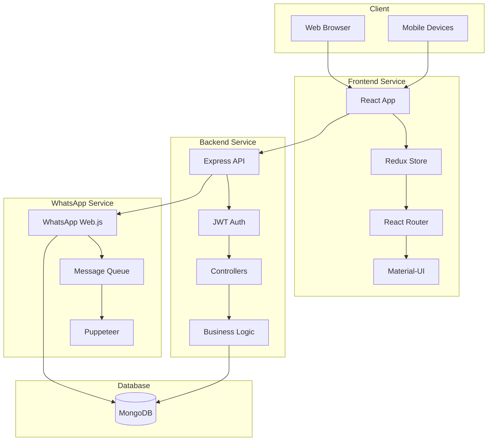
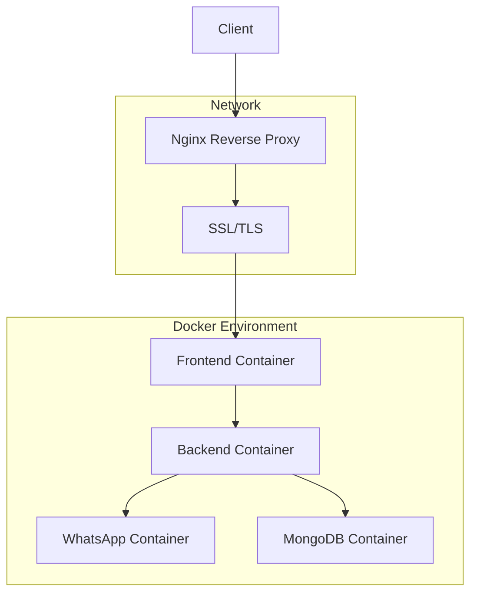

# InviteR Architecture Documentation

## System Overview

InviteR is built using a microservices architecture with four main components:

1. Frontend Service
2. Backend API Service
3. WhatsApp Service
4. Database Service (MongoDB)

## Architecture Diagram



## Component Details

### 1. Frontend Service (`/frontend`)
- **Technology Stack:**
  - React with TypeScript
  - Vite for build tooling
  - Material-UI for components
  - Redux for state management
  - React Router for navigation
  - Axios for API communication

- **Key Features:**
  - Responsive design
  - Real-time updates
  - Form validation
  - State management
  - Route protection
  - Error handling

### 2. Backend Service (`/backend`)
- **Technology Stack:**
  - Node.js with Express
  - TypeScript
  - JWT for authentication
  - Mongoose for MongoDB
  - Express middleware

- **Key Features:**
  - RESTful API endpoints
  - Authentication & Authorization
  - Request validation
  - Error handling
  - Logging
  - Rate limiting

### 3. WhatsApp Service (`/whatsapp-service`)
- **Technology Stack:**
  - WhatsApp Web.js
  - Puppeteer
  - Node.js
  - Message queue system

- **Key Features:**
  - WhatsApp message sending
  - Session management
  - Message queuing
  - Error handling
  - Connection monitoring
  - Message templates

### 4. Database Service
- **Technology Stack:**
  - MongoDB
  - Mongoose ODM

- **Key Features:**
  - Data persistence
  - Schema validation
  - Indexing
  - Data relationships
  - Backup & recovery

## Data Flow

1. **User Authentication Flow:**
   ```
   Client -> Frontend -> Backend -> JWT -> Client
   ```

2. **Event Creation Flow:**
   ```
   Client -> Frontend -> Backend -> Database
   ```

3. **WhatsApp Message Flow:**
   ```
   Client -> Frontend -> Backend -> WhatsApp Service -> WhatsApp API
   ```

4. **Guest Management Flow:**
   ```
   Client -> Frontend -> Backend -> Database
   ```

## Security Architecture

1. **Authentication:**
   - JWT-based authentication
   - Token refresh mechanism
   - Password hashing with bcrypt

2. **Authorization:**
   - Role-based access control
   - Route protection
   - API endpoint security

3. **Data Protection:**
   - Input validation
   - XSS protection
   - CSRF protection
   - Rate limiting

## Deployment Architecture



## Scalability Considerations

1. **Horizontal Scaling:**
   - Stateless services
   - Load balancing
   - Database replication

2. **Performance Optimization:**
   - Caching strategies
   - Database indexing
   - API response optimization

3. **Monitoring:**
   - Service health checks
   - Performance metrics
   - Error tracking
   - Usage analytics

## Development Workflow

1. **Local Development:**
   - Docker Compose for local environment
   - Hot reloading
   - Development tools

2. **Testing:**
   - Unit tests
   - Integration tests
   - E2E tests
   - API tests

3. **CI/CD:**
   - Automated testing
   - Build process
   - Deployment pipeline

## Error Handling

1. **Frontend:**
   - Global error boundary
   - API error handling
   - Form validation
   - User feedback

2. **Backend:**
   - Error middleware
   - Logging system
   - Error tracking
   - Response standardization

3. **WhatsApp Service:**
   - Connection error handling
   - Message retry mechanism
   - Session recovery
   - Error reporting

## Future Considerations

1. **Potential Improvements:**
   - WebSocket integration
   - Real-time notifications
   - Advanced analytics
   - Mobile app development

2. **Scalability Plans:**
   - Microservices decomposition
   - Message queue integration
   - Cache layer implementation
   - CDN integration 